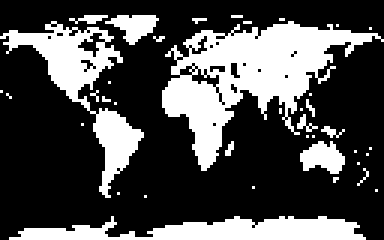
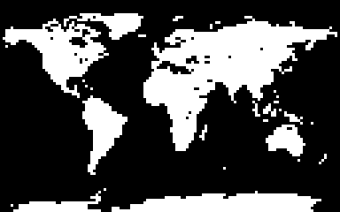

# lego-art-map-generator

Scripts for generating custom mosaics for the LEGO Art 'World Map' set.

It also has some notes of my research into the original LEGO 'World Map' set,
such as how LEGO might have created the projection, and any interesting design
decisions they made.

**This project is not affiliated with The Lego Group.**

## Script descriptions

Scripts are grouped in two sections:

* `map_generator` - Scripts to generate the mosaics
* `map_analysis` - Scripts to analyse tile distributions and bathymetric data.

### Pre-requisites

First make sure python is installed. The run the following commands to install
dependencies and download map data.

```commandline
make install
make download_ne_data
make download_gebco_data
```

### Map Generation

Map generation is split into 5 steps:

* Step 1: Generate a grayscale image of the land-masses.
* Step 2: Convert the image in step 1 into a 1-bit image.
* Step 3: Modify the image in step 2 by adding a shadow to the edges of each landmass. 
* Step 4: Generate a grayscale bathymetric map.
* Step 5: Use the images in step 3 and 4, to distribute the coloured tiles according to proportions outlined in a CSV.

| Step 1                                               | Step 2                                               | Step 3                                               | Step 4                                               | Step 5                                               |
|------------------------------------------------------|------------------------------------------------------|------------------------------------------------------|------------------------------------------------------|------------------------------------------------------|
|  |  |  |  |  |

#### step_1


### Map Analysis

#### count_tiles_from_ascii.py

When I started this project, I created a bunch of ASCII Grid files that
represented the tile placements in the LEGO World Map. You can see them in
[/data/lego_world_map_ascii/](/data/lego_world_map_ascii/).

I created a script that counts the unique colours in an image.

```commandline
poetry run python map_analysis/count_tiles_from_ascii.py data/lego_world_map_ascii/*
``` 

#### count_tiles_from_image.py

Similar to the `count_tiles_from_ascii.py` script, this script counts the
unique colours in an image

```commandline
poetry run python map_analysis/count_tiles_from_image.py readme_files/full_lego.png
```

## Different land rendering attempts

Below are a few variations of the world map using different rendering methods.
The goal is to retain high fidelity to the source image, a grayscale image,
even though it is reduced to a 1-bit image.
Since the LEGO version is artificial, with some islands deliberately scaled up,
it is unlikely that one can create a rendering method that matches the LEGO
map, but if it can match the following criteria, the renderer could be useful
in other non-world-map situations:

* Highlights islands, such as the Kerguelen Islands.
* Highlights narrow seas, such as the Red Sea.

| Rendering Method             | Result                                                              |
|------------------------------|---------------------------------------------------------------------|
| LEGO (full)                  |              |
| LEGO (land)                  |      |
| Render with anti-aliasing    |        |
| Render without anti-aliasing |       |
| [Threshold Filter]           |  |
| [Floyd-Steinberg Dithering]  |     |
| Custom filter                |       |

[Threshold Filter]: https://en.wikipedia.org/wiki/Thresholding_(image_processing)
[Floyd-Steinberg Dithering]: https://en.wikipedia.org/wiki/Floyd–Steinberg_dithering

## Sea-depth rendering attempts

Below are some examples of sea-depth renderings. That is, where the colored
tiles are distributed in a way that resemble the ocean's bathymetry.

The first once is my attempt to recreate the LEGO world map. Unfortunately it's
very hard to match LEGO's map, mainly because I haven't figured out how exactly
their tiles are exactly distributed. It is most likely that someone manually
distributed the tiles.

| Rendering  | Result                                                          |
|------------|-----------------------------------------------------------------|
| LEGO       |          |
| My Attempt |  |

I've also created some custom maps using a similar algorithms, zoomed in and
using a UTM projection.

| Rendering   | Land                                                                   | Sea-depth                                                                              | Result                                                            |
|-------------|------------------------------------------------------------------------|----------------------------------------------------------------------------------------|-------------------------------------------------------------------|
| World Map   |     |     |     |
| North Sea   |  |  |  |
| Iceland     |          |          |          |
| Denmark     |          |          |          |
| Greece      |            |            |            |
| Madagascar  |    |    |    |
| New Guinea  |    |    |    |
| Corsica     |          |          |          |
| New Zealand |  |  |  |

## Tile counts

The official box set contains an excess number of tiles to allow you to
customise the world a bit, but the there are different amounts for each color.

The total number of tiles for each color are listed below:

| Tile color | # of tiles required for World Map | # of tiles in box set according to booklet | Actual # of tiles in my box |
|----------------------------------------------------------------|------|------|------|
| ) | 3062 | 3064 | 3198 |
| )       |  392 |  393 |  410 |
| )    | 1606 | 1607 | 1668 |
| )     | 1878 | 1879 | 1956 |
| )    |  529 |  601 |  621 |
| )  | 1019 | 1060 | 1106 |
| ) |  724 |  725 |  752 |
| ) |  598 |  599 |  619 |
| ) |  229 |  601 |  625 |
| ) |  203 |  601 |  627 |
| **Total** | **10240** | **11130** | **11582** |

I also collected statistics on individual bags that I found in my set.
Your tile count will probably be different to mine, since there appears to be
some randomness.

| Bag name          | tile count |
|-------------------|------------|
| White bag 1       | 1065       |
| White bag 2       | 1067       |
| White bag 3       | 1064       |
| White extras bag  | 2          |
| Navy bag 1        | 408        |
| Navy extras bag   | 2          |
| Cyan bag 1        | 829        |
| Cyan bag 2        | 837        |
| Cyan extras bag   | 2          |
| Teal bag 1        | 977        |
| Teal bag 2        | 977        |
| Teal extras bag   | 2          |
| Green bag         | 619        |
| Green extras bag  | 2          |
| Olive bag         | 1104       |
| Olive extras bag  | 2          |
| Beige bag         | 750        |
| Beige extras bag  | 2          |
| Yellow bag        | 617        |
| Yellow extras bag | 2          |
| Orange bag        | 623        |
| Orange extras bag | 2          |
| Coral bag         | 625        |
| Coral extras bag  | 2          |

## Script descriptions

### count_tiles_from_ascii.py

Iterates through space separated CSV or ASCII Grid files and returns the total
number of tiles grouped by the tile number.  

How to run:

```console
% poetry run python map_analysis/count_tiles_from_ascii.py ./data/lego_world_map_ascii/column-*.asc
```

### count_tiles_from_image.py

Iterates through image files and returns the total number of tiles grouped by
the tile color.  

How to run:

```console
% poetry run python map_analysis/count_tiles_from_image.py ./readme_files/full_lego.png
```
