# lego-art-map-generator

Scripts for generating custom mosaics for the LEGO [31203 World Map] set.

The mosaics aim to imitate the same style as the original 'World Map' set, with
white tiles representing land and coloured tiles representing the bathymetry.

**This project is not affiliated with The Lego Group.**

[31203 World Map]: https://www.lego.com/en-gb/product/world-map-31203

## Examples

Below is a proof of concept that show a recreation of the LEGO World Map using
the scripts in this repository. One can tweak the parameters to get different
results, so this is just an example of what is possible using these scripts.

| Recreation                                                      | Original (By LEGO)                                      |
|-----------------------------------------------------------------|---------------------------------------------------------|
| 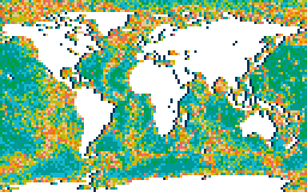 | 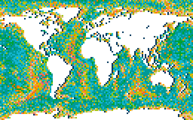 |

The actual purpose of this repository was to create custom maps. The land and
sea-depth images hopefully provide some context as to how the bathymetric data
is used to distribute the coloured tiles.

| Rendering           | Land                                                                                 | Sea-depth                                                                                            | Result                                                                          |
|---------------------|--------------------------------------------------------------------------------------|------------------------------------------------------------------------------------------------------|---------------------------------------------------------------------------------|
| World Map           |                   | 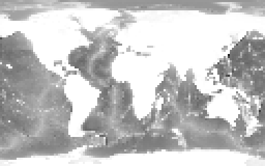                  |                   |
| North Sea           | 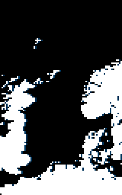               | 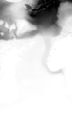               | 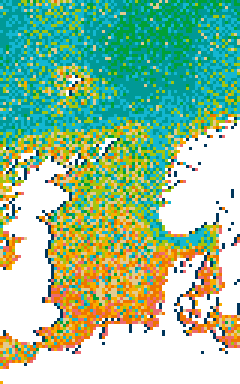               |
| Iceland             | 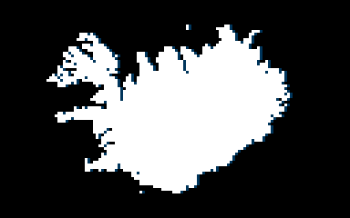                       | 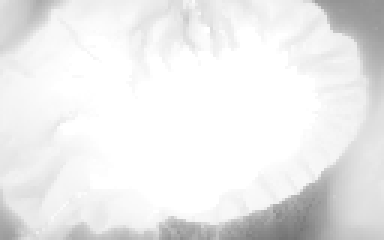                       | 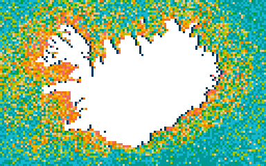                       |
| Denmark             | 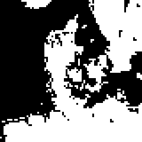                       | 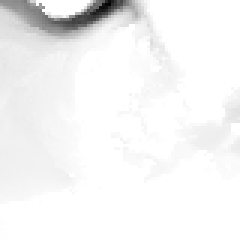                       | 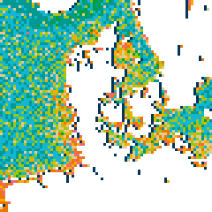                       |
| Greece              | 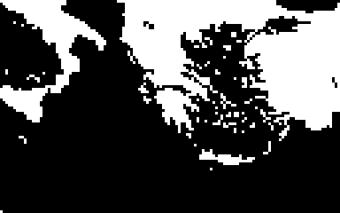                         | 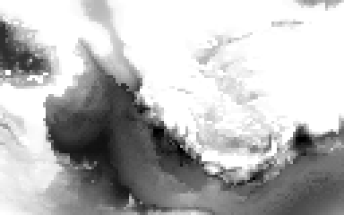                         | 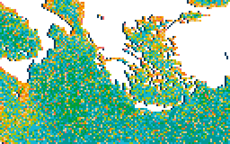                         |
| Madagascar          | 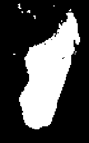                 |                  | 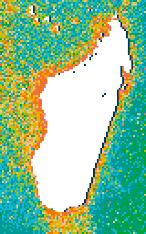                 |
| New Guinea          | 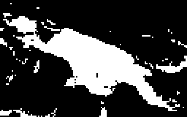                 | 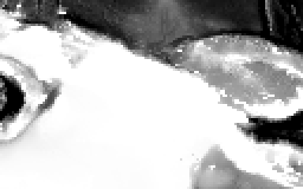                 | 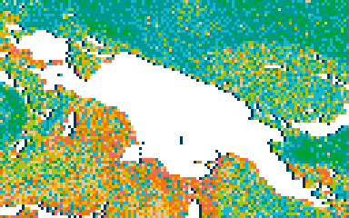                 |
| Corsica             | 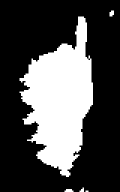                       |                        | 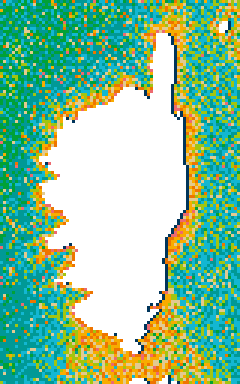                       |
| New Zealand         | 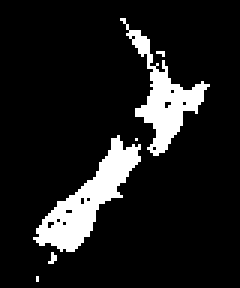               | 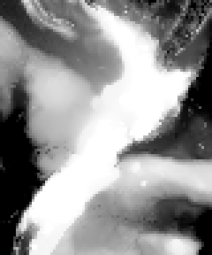               | 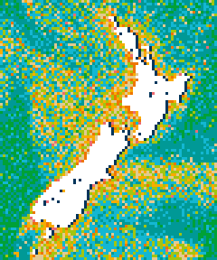               |
| Scotland            | 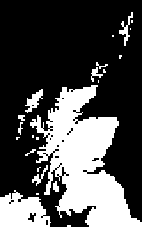                     | 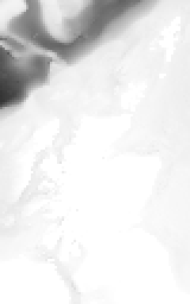                     | 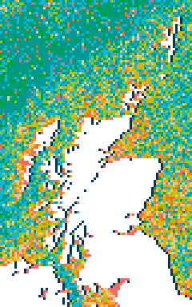                     |
| Scotland (Mainland) | 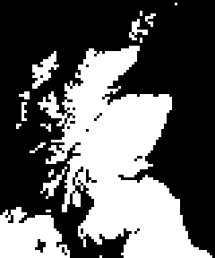 | 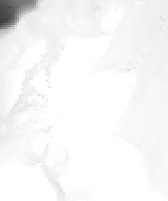 | 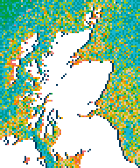 |

## Project structure

The project is grouped in three sections:

* [`data`](/data) - Where all the bathymetry and coastline data is stored.
* [`map_generator`](/map_generator) - Scripts to generate the mosaics
* [`map_analysis`](/map_analysis) - Tool scripts to analyse tile distributions and bathymetric data.

### Pre-requisites

First make sure python is installed. Then run the following commands to install
dependencies and download map data.

```commandline
make install
make download_ne_data
make download_gebco_data
```

## Map Generation

Map generation is split into 5 steps, each is its own script:

* Step 1: Generate a grayscale image of the land-masses.
* Step 2: Convert the image in step 1 into a 1-bit image.
* Step 3: Modify the image in step 2 by adding a shadow to the edges of each landmass. 
* Step 4: Generate a grayscale bathymetric map.
* Step 5: Use the images in step 3 and 4, to distribute the coloured tiles according to proportions outlined in a CSV.

| Step 1                                         | Step 2                                         | Step 3                                         | Step 4                                         | Step 5                                         |
|------------------------------------------------|------------------------------------------------|------------------------------------------------|------------------------------------------------|------------------------------------------------|
|  | 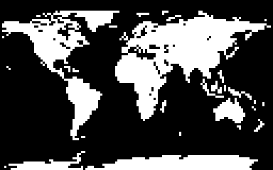 | 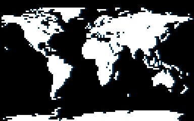 |  |  |

The [Makefile](/Makefile) has some examples of how the scripts are used in practice. 

### Step 1 - Coastline generation

This step comes in two varieties.

To recreate the world map similar to the LEGO world map, run this script:

```commandline
poetry run python map_generator/step_1_land_grayscale_world_map.py step_1.png
```

To generate a custom map of a specific part of the globe, run this other
script, which takes in numerous parameters for controlling the projection. This
includes `center` (longitude/latitude), `scale` (meters per pixel), `rotation`
(Degrees). The UTM projection is used, and will adapt to the `center` position
you pick to minimize distortion. The size of the canvas can also be controlled
using `size`.

```commandline
poetry run python map_generator/step_1_land_grayscale_utm_map.py step_1.png --size=80,128 --center=1.8,58.8 --scale=15000 --rotation=25
```

Here is an example of the output:


### Step 2 - Converting the image to a 1-bit image

This script will convert a grayscale image of the landmasses into a 1-bit image
consisting only of black and white pixels. The algorithm used can be controlled
with the `mode` flag.

```commandline
poetry run python map_generator/step_2_grayscale_to_1bit.py step_1.png step_2.png --mode=custom_1
```

The different modes are: 

* `threshold` uses a simple 50/50 [Threshold Filter],
* `dither` uses [Floyd-Steinberg Dithering],
* `custom_1` uses a custom algorithm I made that does some vague kernel
filtering that takes into account the neighboring pixels. This mode is
recommended because the other modes often lose detail or add
unwanted details.

| `threshold`                                                         | `dither`                                                         | `custom_1`                                                     |
|---------------------------------------------------------------------|------------------------------------------------------------------|----------------------------------------------------------------|
| 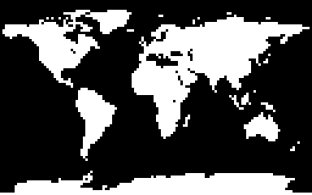 |  |  |

[Threshold Filter]: https://en.wikipedia.org/wiki/Thresholding_(image_processing)
[Floyd-Steinberg Dithering]: https://en.wikipedia.org/wiki/Floyd–Steinberg_dithering

### Step 3 - Add a shadow to the landmasses

This script takes any black and white image from step 2 (`step_2.png`), adds a
dark-blue  shadow to the white tiles on the right-hand side, and saves it to an
output path (`step_3.png`)

```commandline
poetry run python map_generator/step_3_land_shadow.py step_2.png step_3.png
```

### Step 4 - Bathymetry generation

**Warning:** This script might take a while to run.

This script generates a grayscale image of the bathymetry data. The grayscale
image represents sea-level as `#FFFFFF`, and the lowest sea-depth as `#000000`.
Similar to Step 1, there are two scripts to choose from.

To recreate the world map similar to the LEGO world map, run this script:

```commandline
poetry run python map_generator/step_4_sea_grayscale_world_map.py step_3.png step_4.png
```

To generate a custom map of a specific part of the globe, run this other
script, which takes in similar parameters to the script in Step 1. An
additional argument is required for determining the lowest sea-depth using
`max-depth`, which is measured in meters.

```commandline
poetry run python map_generator/step_4_sea_grayscale_utm_map.py step_3.png step_4.png --size=80,128 --center=1.8,58.8 --scale=15000 --rotation=25 --max-depth=3500
```

The first argument of both scripts is an image that is used as a mask for
determining which pixels to calculate a sea-depth for. For example, if a pixel
already has a colour assigned against it (e.g. `#FFFFFF`) it will skip on to
the next pixel. Only when the colour is `#000000` will the script compute a
colour.

### Step 5 - Generate the final mosaic

The final and most complicated script will take in multiple input files to
distribute the coloured tiles on-top of the image generated in Step 3.

The parameters, in order, are:

* The image from Step 3.
* The image from Step 4.
* A CSV of the proportions, which correlates image brightness to colour
distribution. Each column in the CSV represents the proportion that each colour
has at a particular "depth" in the map. The headers represent the brightness
values of the image from 0 to 255 in the image from Step 4.
* A CSV of the tile counts for each colour that can be used in the final mosaic.
* The output file path.

```commandline
poetry run python map_generator/step_5_sea.py step_3.png step_4.png data/north_sea_map_brightness_tile_proportion.csv data/world_map_max_tile_counts.csv step_5.png
```

### Step 6 - Generate High-res image (Optional)

To create an enlarged scale of the final image with rounded tiles instead of
basic pixels, run this script.

```commandline
poetry run python map_generator/step_6_pixels_to_lego.py step_5.png step_6.png
```

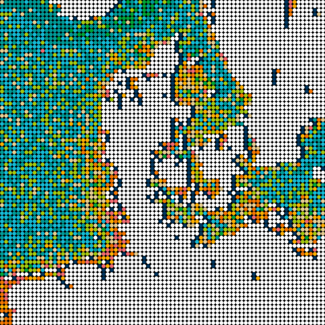

## Map Analysis

### count_tiles_from_image.py

After generating the 1-bit image in Step 2 you might want to check that
you have enough white tiles to actually create the image. This script will be
helpful in doing a quick count of all the pixels in an image.

Below is a quick example of what the script output looks like:

```
poetry run python map_analysis/count_tiles_from_image.py step_3.png
0,0,0:          6832
01 - White:     3039
02 - Navy:       369
total:         10240
```

### count_tiles_from_ascii.py

When I started this project, I created a bunch of ASCII Grid files that
represented the tile placements in the official LEGO World Map. You can see
them in [/data/lego_world_map_ascii/](/data/lego_world_map_ascii/).

I created a script that counts the unique numbers in the files, similar to the
`count_tiles_from_image.py` script.

```commandline
poetry run python map_analysis/count_tiles_from_ascii.py data/lego_world_map_ascii/*
```

### The other scripts

Two other scripts exist in this directory, but they are mainly written in a
rush to do some quick analysis of the data. I may or may not document this
in the future. 

## Tile counts

The official box set contains an excess number of tiles to allow you to
customise the world a bit, but the there are different amounts for each color.

The total number of tiles for each color are listed below:

| Tile color | # of tiles required for World Map | # of tiles in box set according to booklet | Actual # of tiles in my box |
|----------------------------------------------------------------|------|------|------|
| ) | 3062 | 3064 | 3198 |
| )       |  392 |  393 |  410 |
| )    | 1606 | 1607 | 1668 |
| )     | 1878 | 1879 | 1956 |
| )    |  529 |  601 |  621 |
| )  | 1019 | 1060 | 1106 |
| ) |  724 |  725 |  752 |
| ) |  598 |  599 |  619 |
| ) |  229 |  601 |  625 |
| ) |  203 |  601 |  627 |
| **Total** | **10240** | **11130** | **11582** |

I also collected statistics on individual bags that I found in my set.
Your tile count will probably be different to mine, since there appears to be
some randomness.

| Bag name          | tile count |
|-------------------|------------|
| White bag 1       | 1065       |
| White bag 2       | 1067       |
| White bag 3       | 1064       |
| White extras bag  | 2          |
| Navy bag 1        | 408        |
| Navy extras bag   | 2          |
| Cyan bag 1        | 829        |
| Cyan bag 2        | 837        |
| Cyan extras bag   | 2          |
| Teal bag 1        | 977        |
| Teal bag 2        | 977        |
| Teal extras bag   | 2          |
| Green bag         | 619        |
| Green extras bag  | 2          |
| Olive bag         | 1104       |
| Olive extras bag  | 2          |
| Beige bag         | 750        |
| Beige extras bag  | 2          |
| Yellow bag        | 617        |
| Yellow extras bag | 2          |
| Orange bag        | 623        |
| Orange extras bag | 2          |
| Coral bag         | 625        |
| Coral extras bag  | 2          |
